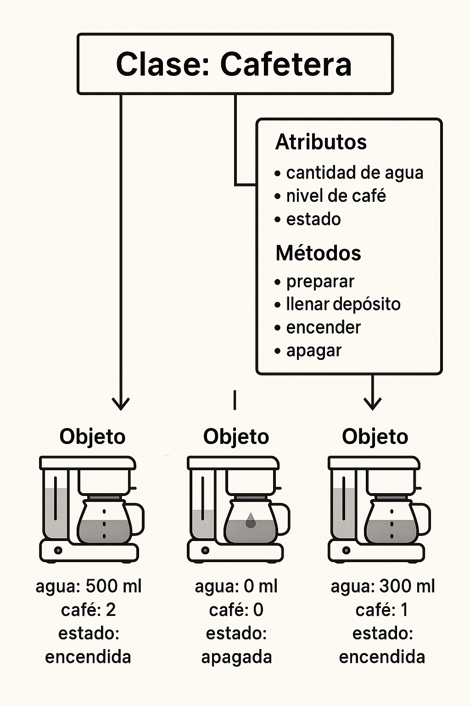

# Introducción a la Programación Orientada a Objetos

La **Programación Orientada a Objetos (POO)** es un paradigma de programación que organiza el código en torno a **objetos**, los cuales representan entidades del mundo real o conceptos abstractos. Cada objeto combina datos y comportamientos, encapsulándolos en una misma unidad.

La POO busca modelar sistemas complejos de una forma más natural y modular, facilitando el desarrollo, mantenimiento y comprensión de los programas. A diferencia de la programación estructurada, que organiza el código en funciones y estructuras de control, la POO agrupa los datos y las operaciones que se pueden realizar sobre ellos dentro de objetos.

## Ventajas de la POO frente a la programación estructurada

A continuación se presentan algunas de las ventajas más relevantes que ofrece la POO en comparación con la programación estructurada tradicional:

* **Modularidad**: El código se organiza en clases, lo que facilita su división en módulos reutilizables.
* **Abstracción**: Permite ocultar los detalles de implementación y trabajar con modelos conceptuales.
* **Encapsulamiento**: Los datos y los métodos se agrupan en clases, lo que protege el estado interno del objeto.
* **Reutilización de código**: Gracias a la herencia y la composición, es posible reutilizar código existente sin duplicación.
* **Mantenimiento simplificado**: Al estar el código dividido en componentes bien definidos, resulta más sencillo localizar y corregir errores.
* **Extensibilidad**: Los programas se pueden ampliar y modificar de forma controlada, gracias a mecanismos como la herencia y el polimorfismo.

## Conceptos básicos: objetos, clases, atributos y métodos

Para comprender la POO en C++, es necesario familiarizarse con sus conceptos fundamentales:

* **Clases**: Una **clase** es un plano o plantilla que define las características y comportamientos de un conjunto de objetos. Especifica:
    * Los **atributos** o **miembros de datos**: las propiedades o características de los objetos.
    * Los **métodos** o **miembros función**: las operaciones o comportamientos que los objetos pueden realizar.
* **Objetos**: Un **objeto** es una instancia concreta de una clase. Representa una entidad específica que posee un estado propio y puede ejecutar acciones definidas por la clase.
* **Atributos**: Los **atributos** son las variables que describen el estado de un objeto. Cada objeto mantiene sus propios valores de estos atributos.
* **Métodos**: Los **métodos** son funciones asociadas a la clase que definen el comportamiento de los objetos. Pueden consultar o modificar el estado del objeto, o realizar acciones.

## Ejemplo conceptual: Cafetera como objeto

Imaginemos que queremos modelar una **cafetera** en un sistema.

* La **clase** sería el modelo general de una cafetera: describe qué características tiene y qué puede hacer.
* Un **objeto** sería una cafetera concreta, por ejemplo, la que está en la cocina de tu casa.
* Los **atributos** podrían ser: cantidad de agua, nivel de café, estado (encendida o apagada).
* Los **métodos** podrían ser: encender, preparar café, apagar, rellenar depósito.

Cada vez que creamos una nueva cafetera en nuestro sistema, estaríamos creando un nuevo objeto a partir de la clase "Cafetera". Cada objeto tiene su propio estado: una cafetera puede estar encendida, otra apagada; una puede tener el depósito lleno, otra vacío.

